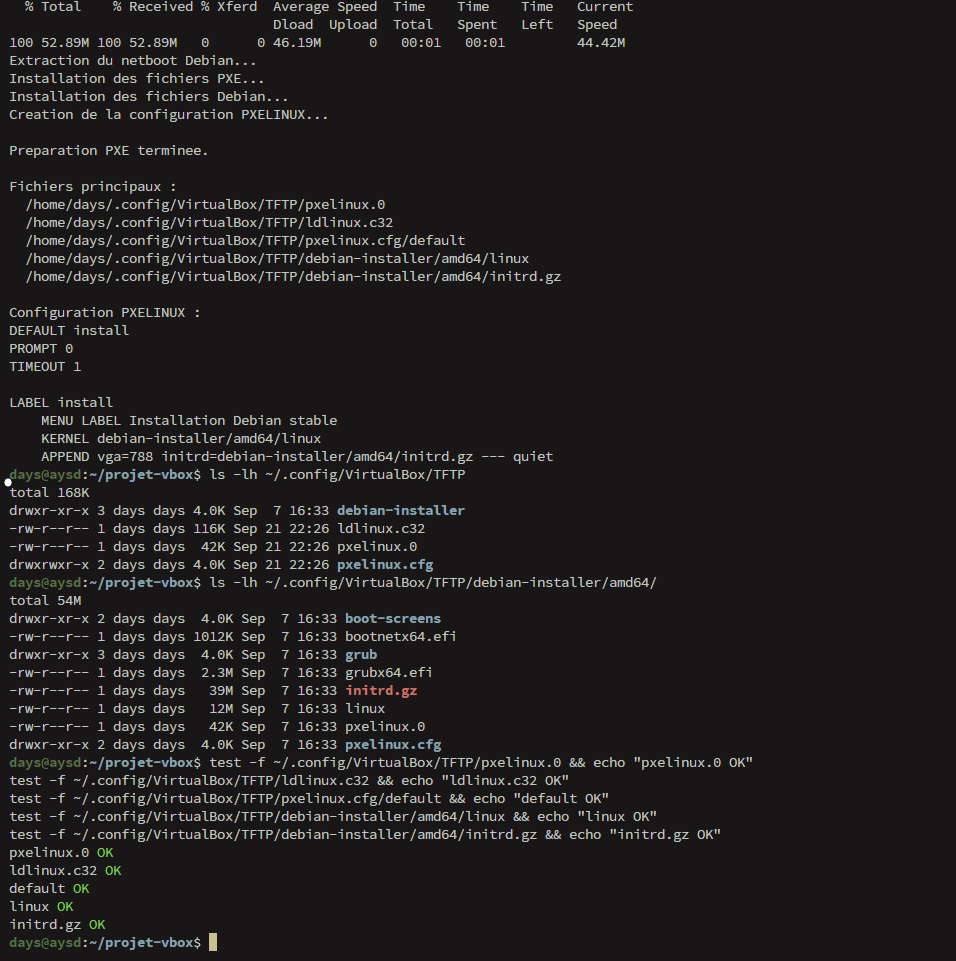
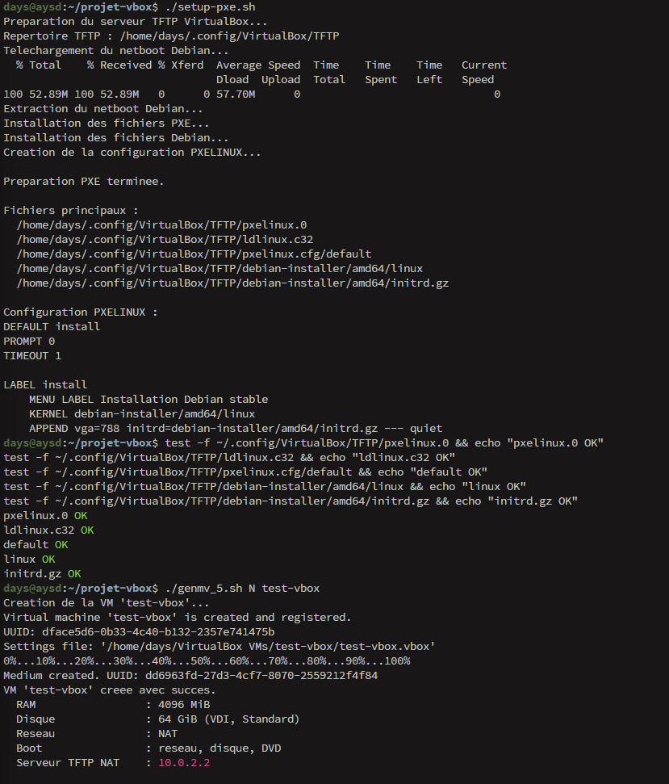
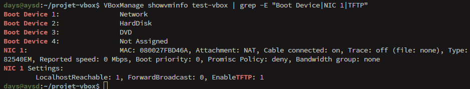
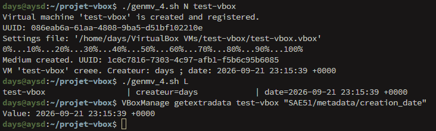
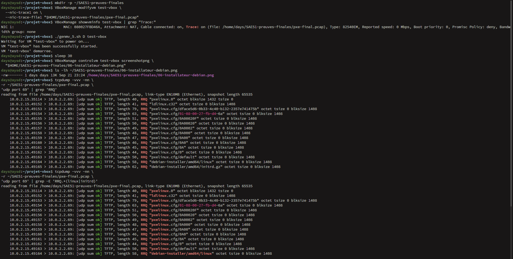
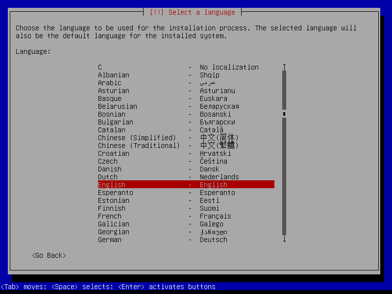
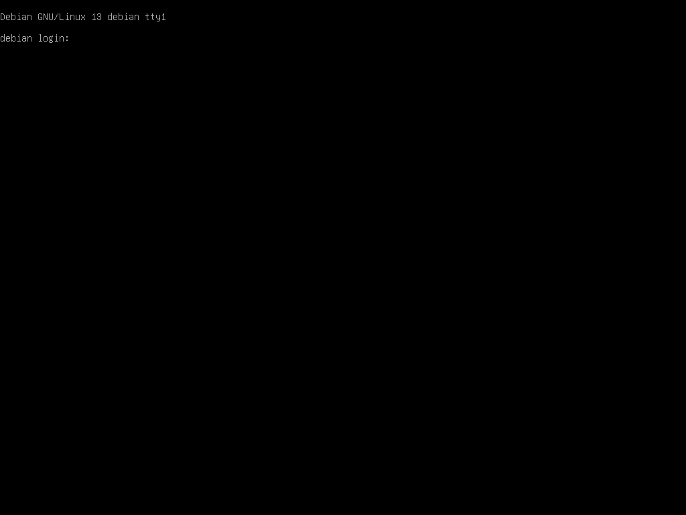
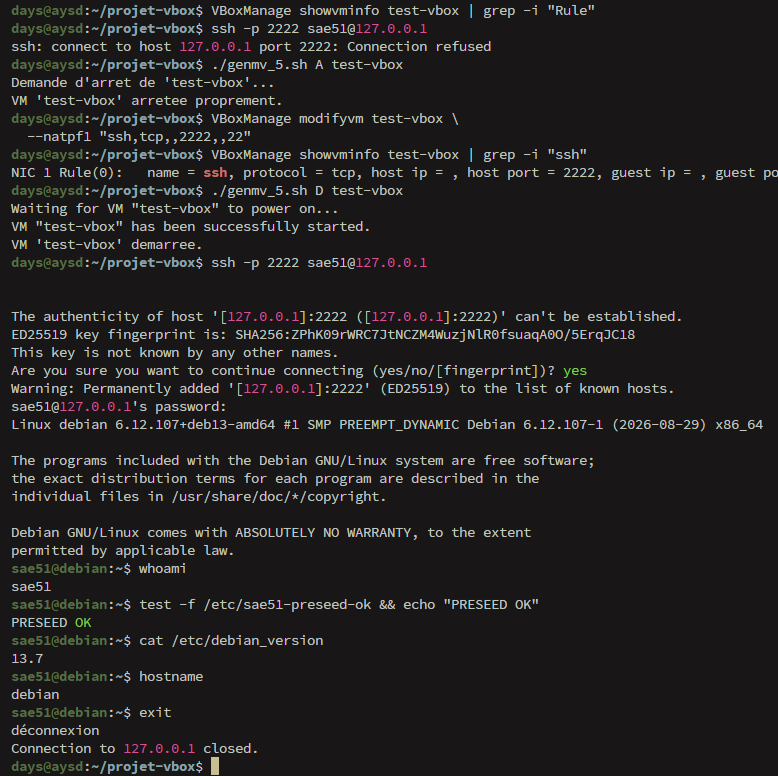

# Tutoriel de test illustré - SAE 51

## Objectif

Ce document décrit le déroulement pratique du test du projet `projet-vbox`.

La solution retenue est l'implémentation Bash sous Linux avec `VBoxManage`.

Le test final couvre :

```text
Préparation PXE
      ↓
Création de la VM
      ↓
Configuration NAT + TFTP + PXE
      ↓
Démarrage réseau
      ↓
Chargement de l'installateur Debian
      ↓
Installation Debian automatisée par Preseed
      ↓
Démarrage sur le système installé
      ↓
Connexion SSH
      ↓
Vérification du système
      ↓
Arrêt et suppression de la VM
```

## 1. Récupération du projet

```bash
git clone https://github.com/Ima-H03/projet-vbox.git
cd projet-vbox
```

Vérifier :

```bash
ls
```

Les principaux fichiers sont :

```text
README.md
usage.md
suivi_projet.md
tutoriel_test_sae51.md
genmv_1.sh
genmv_2.sh
genmv_3.sh
genmv_4.sh
genmv_5.sh
setup-pxe.sh
preseed.cfg
```

## 2. Droits d'exécution

```bash
chmod +x *.sh
```

## 3. Vérification de la syntaxe

```bash
bash -n genmv_1.sh
bash -n genmv_2.sh
bash -n genmv_3.sh
bash -n genmv_4.sh
bash -n genmv_5.sh
bash -n setup-pxe.sh
```

Aucune sortie indique qu'aucune erreur de syntaxe Bash n'a été détectée.

## 4. Préparation PXE

```bash
./setup-pxe.sh
```

Le script télécharge le netboot Debian et prépare :

```text
~/.config/VirtualBox/TFTP
```

Les principaux fichiers sont :

```text
pxelinux.0
ldlinux.c32
preseed.cfg
pxelinux.cfg/default
debian-installer/amd64/linux
debian-installer/amd64/initrd.gz
```



Vérification :

```bash
test -f ~/.config/VirtualBox/TFTP/pxelinux.0 && echo "pxelinux.0 OK"
test -f ~/.config/VirtualBox/TFTP/ldlinux.c32 && echo "ldlinux.c32 OK"
test -f ~/.config/VirtualBox/TFTP/preseed.cfg && echo "preseed.cfg OK"
test -f ~/.config/VirtualBox/TFTP/pxelinux.cfg/default && echo "default OK"
test -f ~/.config/VirtualBox/TFTP/debian-installer/amd64/linux && echo "linux OK"
test -f ~/.config/VirtualBox/TFTP/debian-installer/amd64/initrd.gz && echo "initrd.gz OK"
```

## 5. Création de la VM

```bash
./genmv_5.sh N test-vbox
```

Configuration utilisée :

```text
RAM       : 4096 MiB
Disque    : 64 GiB
Réseau    : NAT
Boot 1    : Network
Boot 2    : HardDisk
Boot 3    : DVD
TFTP NAT  : 10.0.2.2
Fichier   : pxelinux.0
```



## 6. Vérification de la configuration PXE

```bash
VBoxManage showvminfo test-vbox | grep -E "Boot Device|NIC 1|TFTP"
```

Vérifier notamment :

```text
Boot Device 1: Network
Attachment: NAT
EnableTFTP: 1
```



## 7. Métadonnées VirtualBox

```bash
./genmv_4.sh L
```

Puis :

```bash
VBoxManage getextradata test-vbox "SAE51/metadata/creation_date"
VBoxManage getextradata test-vbox "SAE51/metadata/creator"
```



## 8. Activer la capture réseau

```bash
mkdir -p ~/SAE51-preuves-finales
```

```bash
VBoxManage modifyvm test-vbox \
  --nic-trace1 on \
  --nic-trace-file1 "$HOME/SAE51-preuves-finales/pxe-preseed.pcap"
```

Vérifier :

```bash
VBoxManage showvminfo test-vbox | grep "Trace:"
```

## 9. Démarrage PXE

```bash
./genmv_5.sh D test-vbox
```

Attendre le démarrage :

```bash
sleep 30
```

## 10. Vérifier les échanges TFTP

```bash
tcpdump -vvv -nn \
-r ~/SAE51-preuves-finales/pxe-preseed.pcap \
'udp port 69' | grep 'RRQ'
```

Rechercher en particulier :

```text
RRQ "pxelinux.0"
RRQ "ldlinux.c32"
RRQ "pxelinux.cfg/default"
RRQ "debian-installer/amd64/linux"
RRQ "debian-installer/amd64/initrd.gz"
RRQ "preseed.cfg"
```



## 11. Vérifier le lancement de l'installateur

Créer une capture :

```bash
VBoxManage controlvm test-vbox screenshotpng \
  ~/SAE51-preuves-finales/installateur-debian.png
```



Cette capture montre le lancement de l'installateur Debian.

## 12. Installation automatisée avec Preseed

Le fichier :

```text
preseed.cfg
```

est téléchargé depuis le serveur TFTP et fournit automatiquement les réponses prévues pour l'installation.

La configuration PXELINUX utilise :

```text
preseed/url=tftp://10.0.2.2/preseed.cfg
```

Le test de l'installation doit être suivi jusqu'à sa fin sans intervention manuelle pour les paramètres pris en charge par le preseed.

## 13. Vérifier la fin de l'installation

Après l'installation, la VM démarre sur le système Debian installé.

Une capture de la console peut être réalisée :

```bash
VBoxManage controlvm test-vbox screenshotpng \
  ~/SAE51-preuves-finales/systeme-debian-installe.png
```

### Preuve du système installé



Cette capture montre :

```text
Debian GNU/Linux 13 debian tty1
debian login:
```

Elle constitue la preuve que l'installation est terminée et que la VM est arrivée sur un système Debian installé, avec le service de connexion disponible.

## 14. Configuration de la redirection SSH

Ajouter une redirection du port 2222 de l'hôte vers le port 22 de la VM :

```bash
VBoxManage modifyvm test-vbox \
  --natpf1 "ssh,tcp,,2222,,22"
```

Vérifier :

```bash
VBoxManage showvminfo test-vbox | grep -i "Rule"
```

La règle doit correspondre à :

```text
ssh,tcp,,2222,,22
```

Le chemin est :

```text
127.0.0.1:2222
      ↓
NAT VirtualBox
      ↓
VM Debian : 22
```

## 15. Connexion SSH

Depuis l'hôte :

```bash
ssh -p 2222 sae51@127.0.0.1
```

Une fois connecté :

```bash
whoami
```

Résultat attendu :

```text
sae51
```

Puis :

```bash
test -f /etc/sae51-preseed-ok && echo "PRESEED OK"
```

Puis :

```bash
cat /etc/debian_version
```

Et :

```bash
hostname
```



La connexion SSH permet de vérifier que le système installé est accessible depuis l'hôte.

## 16. Vérification distante

Tester également une commande directement depuis l'hôte :

```bash
ssh -p 2222 sae51@127.0.0.1 'whoami && cat /etc/debian_version && hostname'
```

## 17. Fin du test

Quitter la session SSH :

```bash
exit
```

Arrêter la VM :

```bash
./genmv_5.sh A test-vbox
```

Vérifier :

```bash
VBoxManage showvminfo test-vbox | grep "State:"
```

Supprimer la VM :

```bash
./genmv_5.sh S test-vbox
```

Puis :

```bash
VBoxManage list vms
```

`test-vbox` ne doit plus apparaître.

## 18. Vérification finale du dépôt

```bash
cd ~/projet-vbox
git status
```

Le dépôt doit être propre :

```text
nothing to commit, working tree clean
```

Puis :

```bash
git log --oneline -5
```

## 19. Résultat final attendu

Le projet est testé selon la chaîne suivante :

```text
Clone du dépôt
      ↓
setup-pxe.sh
      ↓
Préparation TFTP
      ↓
genmv_5.sh N test-vbox
      ↓
Configuration VirtualBox
      ↓
Boot PXE
      ↓
linux + initrd.gz
      ↓
preseed.cfg
      ↓
Installation Debian
      ↓
Debian installé
      ↓
Connexion SSH
      ↓
Vérification PRESEED OK
      ↓
Arrêt
      ↓
Suppression
```

## 20. Captures utilisées

```text
captures/
├── 01_preparation_pxe.png
├── 02_creation_genmv5.png
├── 03_configuration_pxe.png
├── 04_metadata_genmv4.png
├── 05_verification_tftp.png
├── 06_installateur_debian.png
├── 07_arret_suppression.png
└── 08_systeme_debian_installe_tty.png
```
